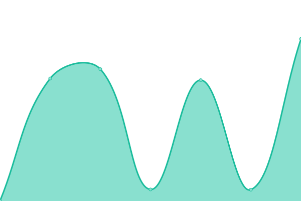

# [📈 Live Status](https://a1exalexander.github.io/upptime): <!--live status--> **🟩 All systems operational**

This repository contains the open-source uptime monitor and status page for [Alexander](https://a1exalexander.github.io), powered by [Upptime](https://github.com/upptime/upptime).

With [Upptime](https://upptime.js.org), you can get your own unlimited and free uptime monitor and status page, powered entirely by a GitHub repository. We use [Issues](https://github.com/a1exalexander/upptime/issues) as incident reports, [Actions](https://github.com/a1exalexander/upptime/actions) as uptime monitors, and [Pages](https://a1exalexander.github.io/upptime) for the status page.

<!--start: status pages-->
<!-- This summary is generated by Upptime (https://github.com/upptime/upptime) -->
<!-- Do not edit this manually, your changes will be overwritten -->

| URL                                             | Status | History                                                                                              | Response Time                                                                     | Uptime                                                                                                                                                                                                                                |
| ----------------------------------------------- | ------ | ---------------------------------------------------------------------------------------------------- | --------------------------------------------------------------------------------- | ------------------------------------------------------------------------------------------------------------------------------------------------------------------------------------------------------------------------------------- |
| [School 23](https://school23.now.sh/)           | 🟩 Up  | [school-23.yml](https://github.com/a1exalexander/upptime/commits/master/history/school-23.yml)       |  2016ms   |        |
| [Exchnanger](https://exchanger.now.sh/)         | 🟩 Up  | [exchnanger.yml](https://github.com/a1exalexander/upptime/commits/master/history/exchnanger.yml)     |  670ms   |      |
| [Stay At Home](https://self-isolation.now.sh/)  | 🟩 Up  | [stay-at-home.yml](https://github.com/a1exalexander/upptime/commits/master/history/stay-at-home.yml) |  626ms |  |
| [Media Scout](https://media-scout.netlify.app/) | 🟩 Up  | [media-scout.yml](https://github.com/a1exalexander/upptime/commits/master/history/media-scout.yml)   |  93ms   |    |
| [Merge](https://www.merge.rocks/)               | 🟩 Up  | [merge.yml](https://github.com/a1exalexander/upptime/commits/master/history/merge.yml)               |  177ms        |                |

<!--end: status pages-->

[**Visit our status website →**](https://a1exalexander.github.io/upptime)

## 📄 License

- Code: [MIT](./LICENSE) © [Alexander](https://a1exalexander.github.io)
- Data in the `./history` directory: [Open Database License](https://opendatacommons.org/licenses/odbl/1-0/)
