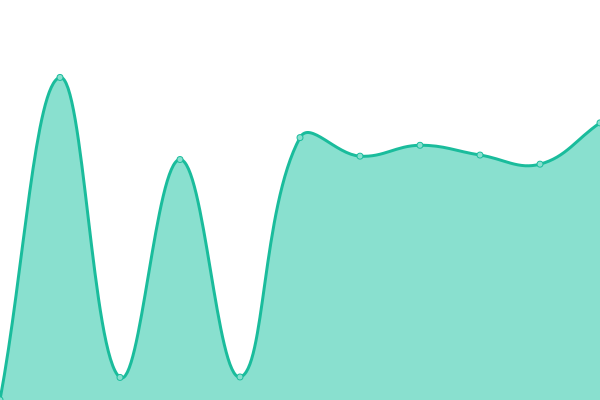
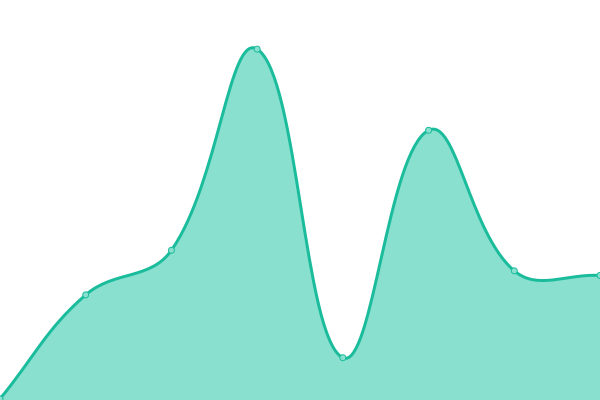
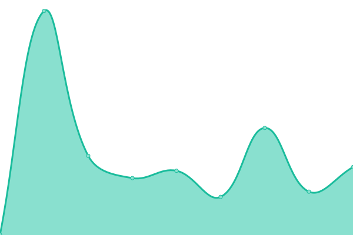
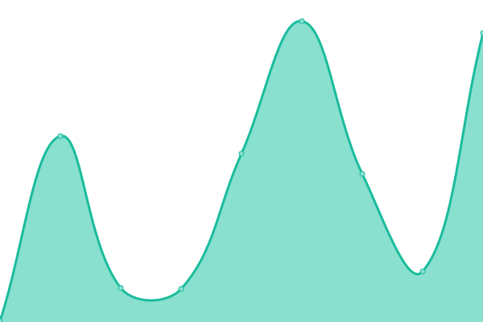
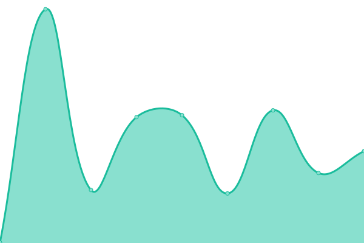

# [📈 Live Status](https://a1exalexander.github.io/upptime): <!--live status--> **🟩 All systems operational**

This repository contains the open-source uptime monitor and status page for [Alexander](https://a1exalexander.github.io), powered by [Upptime](https://github.com/upptime/upptime).

With [Upptime](https://upptime.js.org), you can get your own unlimited and free uptime monitor and status page, powered entirely by a GitHub repository. We use [Issues](https://github.com/a1exalexander/upptime/issues) as incident reports, [Actions](https://github.com/a1exalexander/upptime/actions) as uptime monitors, and [Pages](https://a1exalexander.github.io/upptime) for the status page.

<!--start: status pages-->
<!-- This summary is generated by Upptime (https://github.com/upptime/upptime) -->
<!-- Do not edit this manually, your changes will be overwritten -->

| URL                                                                               | Status | History                                                                                                                                        | Response Time                                                                                          | Uptime                                                                                                                                                                                                                                                                         |
| --------------------------------------------------------------------------------- | ------ | ---------------------------------------------------------------------------------------------------------------------------------------------- | ------------------------------------------------------------------------------------------------------ | ------------------------------------------------------------------------------------------------------------------------------------------------------------------------------------------------------------------------------------------------------------------------------ |
| [Merge (Our Team Website)](https://www.merge.rocks/)                              | 🟩 Up  | [merge-our-team-website.yml](https://github.com/a1exalexander/upptime/commits/master/history/merge-our-team-website.yml)                       |  216ms            |                         |
| [Noviscient (Investment Management)](https://portal.noviscient.com/)              | 🟩 Up  | [noviscient-investment-management.yml](https://github.com/a1exalexander/upptime/commits/master/history/noviscient-investment-management.yml)   |  822ms  |    |
| [Tokenplace (Trading Terminal)](https://app.tokenplace.com/)                      | 🟩 Up  | [tokenplace-trading-terminal.yml](https://github.com/a1exalexander/upptime/commits/master/history/tokenplace-trading-terminal.yml)             |  187ms       |              |
| [School 23](https://school23.now.sh/)                                             | 🟩 Up  | [school-23.yml](https://github.com/a1exalexander/upptime/commits/master/history/school-23.yml)                                                 |  1285ms                        |                                                  |
| [Exchanger (UAH currency converter)](https://exchanger.now.sh/)                   | 🟩 Up  | [exchanger-uah-currency-converter.yml](https://github.com/a1exalexander/upptime/commits/master/history/exchanger-uah-currency-converter.yml)   |  152ms  |    |
| [Stay At Home (Self Isolation Todo)](https://self-isolation.now.sh/)              | 🟩 Up  | [stay-at-home-self-isolation-todo.yml](https://github.com/a1exalexander/upptime/commits/master/history/stay-at-home-self-isolation-todo.yml)   |  267ms  |    |
| [Tic Tac Toe (PvP Game)](https://tic-tac.vercel.app/)                             | 🟩 Up  | [tic-tac-toe-pv-p-game.yml](https://github.com/a1exalexander/upptime/commits/master/history/tic-tac-toe-pv-p-game.yml)                         |  335ms             |                          |
| [Media Scout (Demo - Youtube manager)](https://media-scout.netlify.app/)          | 🟩 Up  | [media-scout-demo-youtube-manager.yml](https://github.com/a1exalexander/upptime/commits/master/history/media-scout-demo-youtube-manager.yml)   |  143ms  |    |
| [Merge Coworking (Demo)](https://a1exalexander.github.io/merge-draft/dist/)       | 🟩 Up  | [merge-coworking-demo.yml](https://github.com/a1exalexander/upptime/commits/master/history/merge-coworking-demo.yml)                           |  128ms              |                            |
| [Cloudbeat (Demo - Dashboard)](https://cloudbeat.now.sh/)                         | 🟩 Up  | [cloudbeat-demo-dashboard.yml](https://github.com/a1exalexander/upptime/commits/master/history/cloudbeat-demo-dashboard.yml)                   |  233ms          |                    |
| [Biofunder (Demo - Investment Manager)](https://forcewizu.bitbucket.io/biofunder) | 🟩 Up  | [biofunder-demo-investment-manager.yml](https://github.com/a1exalexander/upptime/commits/master/history/biofunder-demo-investment-manager.yml) |  367ms |  |
| [Biofunder (Demo - Back-office)](https://a1exalexander.github.io/riseeds-admin/)  | 🟩 Up  | [biofunder-demo-back-office.yml](https://github.com/a1exalexander/upptime/commits/master/history/biofunder-demo-back-office.yml)               |  23ms         |                |

<!--end: status pages-->

[**Visit our status website →**](https://a1exalexander.github.io/upptime)

## 📄 License

- Code: [MIT](./LICENSE) © [Alexander](https://a1exalexander.github.io)
- Data in the `./history` directory: [Open Database License](https://opendatacommons.org/licenses/odbl/1-0/)
