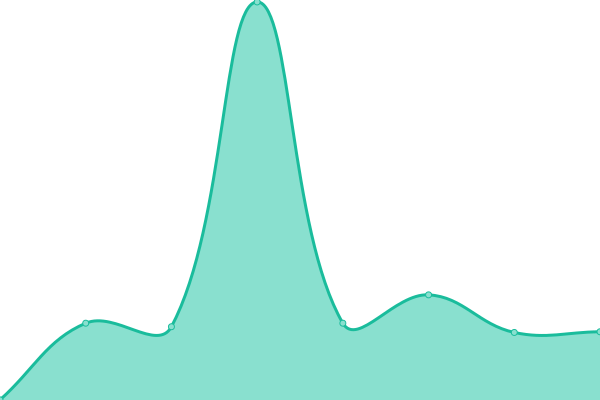
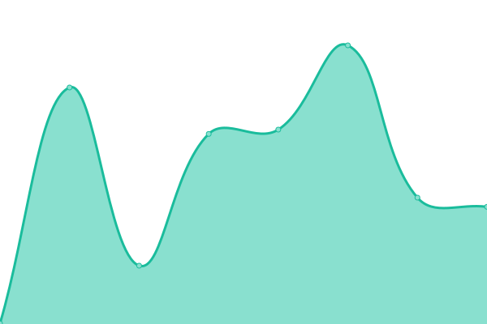
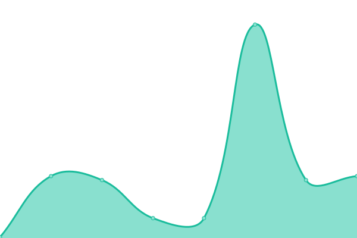
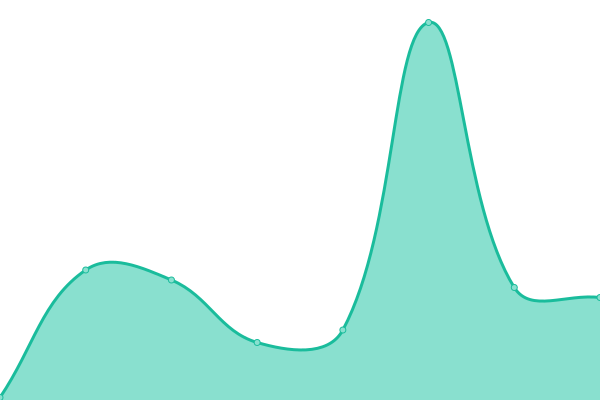

# [📈 Live Status](https://a1exalexander.github.io/upptime): <!--live status--> **🟧 Partial outage**

This repository contains the open-source uptime monitor and status page for [Alexander](https://a1exalexander.github.io), powered by [Upptime](https://github.com/upptime/upptime).

With [Upptime](https://upptime.js.org), you can get your own unlimited and free uptime monitor and status page, powered entirely by a GitHub repository. We use [Issues](https://github.com/a1exalexander/upptime/issues) as incident reports, [Actions](https://github.com/a1exalexander/upptime/actions) as uptime monitors, and [Pages](https://a1exalexander.github.io/upptime) for the status page.

<!--start: status pages-->
<!-- This summary is generated by Upptime (https://github.com/upptime/upptime) -->
<!-- Do not edit this manually, your changes will be overwritten -->
<!-- prettier-ignore -->
| URL | Status | History | Response Time | Uptime |
| --- | ------ | ------- | ------------- | ------ |
|  [Merge (Our Team Website)](https://www.merge.rocks/) | 🟩 Up | [merge-our-team-website.yml](https://github.com/a1exalexander/upptime/commits/HEAD/history/merge-our-team-website.yml) | 

 856ms
     
 | 

<a href="https://a1exalexander.github.io/upptime/history/merge-our-team-website">100.00%</a>
    

|  [Noviscient (Investment Management)](https://portal.noviscient.com/) | 🟩 Up | [noviscient-investment-management.yml](https://github.com/a1exalexander/upptime/commits/HEAD/history/noviscient-investment-management.yml) | 

 735ms
     
 | 

<a href="https://a1exalexander.github.io/upptime/history/noviscient-investment-management">76.64%</a>
    

|  [Tokenplace (Trading Terminal)](https://app.tokenplace.com/) | 🟥 Down | [tokenplace-trading-terminal.yml](https://github.com/a1exalexander/upptime/commits/HEAD/history/tokenplace-trading-terminal.yml) | 

 92ms
     
 | 

<a href="https://a1exalexander.github.io/upptime/history/tokenplace-trading-terminal">0.00%</a>
    

|  [School 23](https://school23.now.sh/) | 🟩 Up | [school-23.yml](https://github.com/a1exalexander/upptime/commits/HEAD/history/school-23.yml) | 

 1585ms
     
 | 

<a href="https://a1exalexander.github.io/upptime/history/school-23">100.00%</a>
    

|  [Exchanger (UAH currency converter)](https://exchanger.now.sh/) | 🟩 Up | [exchanger-uah-currency-converter.yml](https://github.com/a1exalexander/upptime/commits/HEAD/history/exchanger-uah-currency-converter.yml) | 

 385ms
     
 | 

<a href="https://a1exalexander.github.io/upptime/history/exchanger-uah-currency-converter">100.00%</a>
    

|  [Stay At Home (Self Isolation Todo)](https://self-isolation.now.sh/) | 🟩 Up | [stay-at-home-self-isolation-todo.yml](https://github.com/a1exalexander/upptime/commits/HEAD/history/stay-at-home-self-isolation-todo.yml) | 

 387ms
     
 | 

<a href="https://a1exalexander.github.io/upptime/history/stay-at-home-self-isolation-todo">100.00%</a>
    

|  [Tic Tac Toe (PvP Game)](https://tic-tac.vercel.app/) | 🟩 Up | [tic-tac-toe-pv-p-game.yml](https://github.com/a1exalexander/upptime/commits/HEAD/history/tic-tac-toe-pv-p-game.yml) | 

 182ms
     
 | 

<a href="https://a1exalexander.github.io/upptime/history/tic-tac-toe-pv-p-game">100.00%</a>
    

|  [Media Scout (Demo - Youtube manager)](https://media-scout.netlify.app/) | 🟩 Up | [media-scout-demo-youtube-manager.yml](https://github.com/a1exalexander/upptime/commits/HEAD/history/media-scout-demo-youtube-manager.yml) | 

 195ms
     
 | 

<a href="https://a1exalexander.github.io/upptime/history/media-scout-demo-youtube-manager">100.00%</a>
    

|  [Merge Coworking (Demo)](https://a1exalexander.github.io/merge-draft/dist/) | 🟩 Up | [merge-coworking-demo.yml](https://github.com/a1exalexander/upptime/commits/HEAD/history/merge-coworking-demo.yml) | 

 108ms
     
 | 

<a href="https://a1exalexander.github.io/upptime/history/merge-coworking-demo">100.00%</a>
    

|  [Cloudbeat (Demo - Dashboard)](https://cloudbeat.now.sh/) | 🟩 Up | [cloudbeat-demo-dashboard.yml](https://github.com/a1exalexander/upptime/commits/HEAD/history/cloudbeat-demo-dashboard.yml) | 

 374ms
     
 | 

<a href="https://a1exalexander.github.io/upptime/history/cloudbeat-demo-dashboard">100.00%</a>
    

|  [Biofunder (Demo - Investment Manager)](https://forcewizu.bitbucket.io/biofunder) | 🟩 Up | [biofunder-demo-investment-manager.yml](https://github.com/a1exalexander/upptime/commits/HEAD/history/biofunder-demo-investment-manager.yml) | 

 313ms
     
 | 

<a href="https://a1exalexander.github.io/upptime/history/biofunder-demo-investment-manager">100.00%</a>
    

|  [Biofunder (Demo - Back-office)](https://a1exalexander.github.io/riseeds-admin/) | 🟩 Up | [biofunder-demo-back-office.yml](https://github.com/a1exalexander/upptime/commits/HEAD/history/biofunder-demo-back-office.yml) | 

 54ms
     
 | 

<a href="https://a1exalexander.github.io/upptime/history/biofunder-demo-back-office">100.00%</a>
    

<!--end: status pages-->

[**Visit our status website →**](https://a1exalexander.github.io/upptime)

## 📄 License

- Code: [MIT](./LICENSE) © [Alexander](https://a1exalexander.github.io)
- Data in the `./history` directory: [Open Database License](https://opendatacommons.org/licenses/odbl/1-0/)
